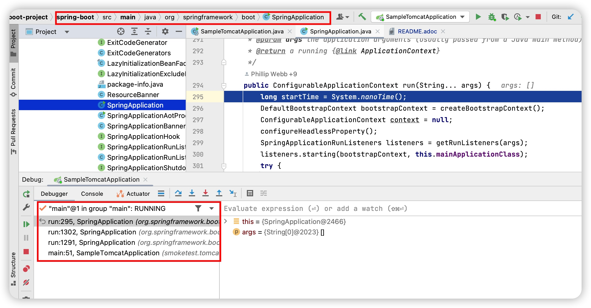

= Spring Boot image:https://ci.spring.io/api/v1/teams/spring-boot/pipelines/spring-boot-3.0.x/jobs/build/badge["Build Status", link="https://ci.spring.io/teams/spring-boot/pipelines/spring-boot-3.0.x?groups=Build"] image:https://badges.gitter.im/Join Chat.svg["Chat",link="https://gitter.im/spring-projects/spring-boot?utm_source=badge&utm_medium=badge&utm_campaign=pr-badge&utm_content=badge"] image:https://img.shields.io/badge/Revved%20up%20by-Gradle%20Enterprise-06A0CE?logo=Gradle&labelColor=02303A["Revved up by Gradle Enterprise", link="https://ge.spring.io/scans?&search.rootProjectNames=Spring%20Boot%20Build&search.rootProjectNames=spring-boot-build"]
:docs: https://docs.spring.io/spring-boot/docs/current-SNAPSHOT/reference
:github: https://github.com/spring-projects/spring-boot

调试使用
本地使用jdk17，地址为：/Users/luobin/workspace/spring-boot

